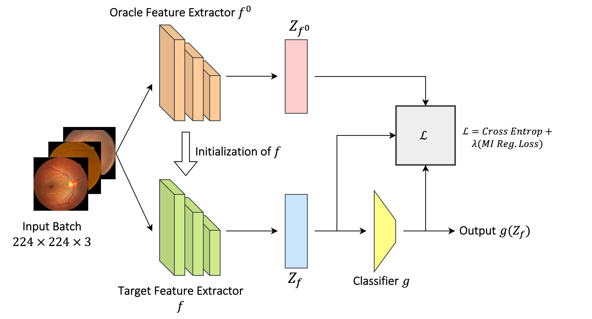

# DGM-DR
Official Repository for the DART 2023 paper titled DGM-DR: Domain Generalization with Mutual Information Regularized Diabetic Retinopathy Classification. Link to the paper: https://arxiv.org/pdf/2309.09670.pdf

# Abstract:
The domain shift between training and testing data presents a significant challenge for training generalizable deep learning models. As a consequence, the performance of models trained with the independent and identically distributed (i.i.d) assumption deteriorates when deployed in the real world. This problem is exacerbated in the medical imaging context due to variations in data acquisition across clinical centers, medical apparatus, and patients. Domain generalization (DG) aims to address this problem by learning a model that generalizes well to any unseen target domain. Many domain generalization techniques were unsuccessful in learning domain-invariant representations due to the large domain shift. Furthermore, multiple tasks in medical imaging are not yet extensively studied in existing literature when it comes to DG point of view. In this paper, we introduce a DG method that re-establishes the model objective function as a maximization of mutual information with a large pretrained model to the medical imaging field. We re-visit the problem of DG in Diabetic Retinopathy (DR) classification to establish a clear benchmark with a correct model selection strategy and to achieve robust domain-invariant representation for an improved generalization. Moreover, we conduct extensive experiments on public datasets to show that our proposed method consistently outperforms the previous state-of-the-art by a margin of 5.25% in average accuracy and a lower standard deviation.

<p align="center">
    
</p>

The application code we use is based on backbone codes from DomainBed[1], MIRO[2] and SWAD[3].

Install required libraries:
```
pip install -r requirements.txt
```

Run training with Diabetic Retinopathy datasets (have to be organized similarly to PACS):
```
python train_all.py exp_name --dataset DR --data_dir /dataset/path --algorithm MIRO
```

To reproduce the best result from the paper, run the following command:

```
python train_all.py exp_name --dataset DR --data_dir /dataset/path --algorithm MIRO --lr 5e-5 --ld 1.0 --swad True --batch_size 32
```

The weights of the trained models are available [here](https://drive.google.com/drive/folders/1XPa9UHlCPxAHm-oFw6ey6gLKlWC9er_D?usp=sharing)

# References
1. Gulrajani, Ishaan, and David Lopez-Paz. "In search of lost domain generalization." arXiv preprint arXiv:2007.01434 (2020).
2. Cha, Junbum, et al. "Domain generalization by mutual-information regularization with pre-trained models." European Conference on Computer Vision. Cham: Springer Nature Switzerland, 2022.
3. Cha, Junbum, et al. "Swad: Domain generalization by seeking flat minima." Advances in Neural Information Processing Systems 34 (2021): 22405-22418.
